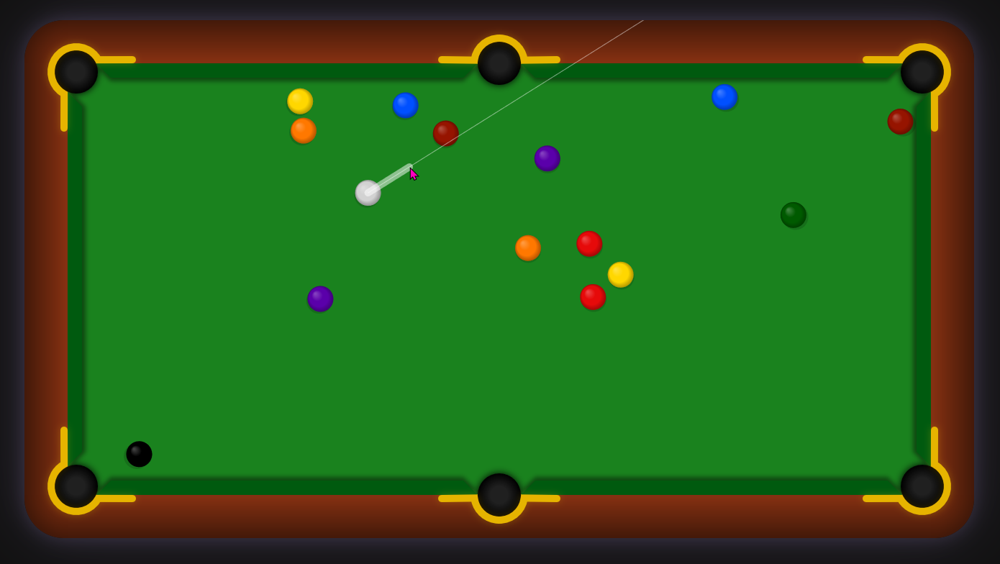

# Pool game

This is a pool game written in Vanilla JavaScript. All drawing operations are done on an HTML canvas. No images are used.

https://pool-game.netlify.app



Use the mouse to determine the orientation and energy of the next shot.

The collision between the balls uses 2-dimensional elastic collision. Of course the balls also bounce off the borders, but also the polygon-shaped bumpers.

There are popups when the game is won (all balls are pocketed, the black one last) or lost (the black ball is pocketed too early, or the black and the white ball are both pocketed). There are sound effects as well.

Ideas for further improvement:

-   mobile version
-   two-player mode
-   striped balls
-   numbers on balls
-   rotation of balls

## Local development

1. Install the dependencies

```bash
npm install
```

2. Build the JS and CSS files

```bash
npm run dev
```

during development or

```bash
npm run build
```

for the production build.

3. Open `dist/index.html`
